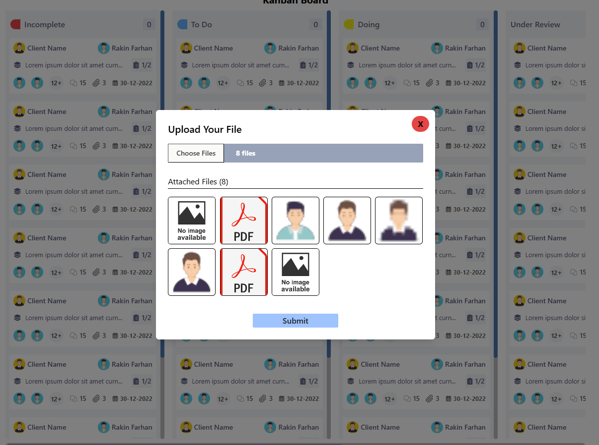
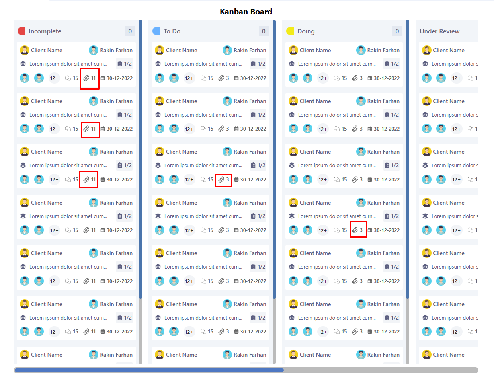

# Project Setup

First clone the repo.

## Backend Setup

1. Navigate to the `backend` folder:

   ```bash
   cd sp1-task-back
   ```

2. Install dependencies:

   ```bash
   npm install
   ```

3. Start the backend server:

   ```bash
   npm run dev
   ```

   Backend will run on `http://localhost:8000`.

---

## Frontend Setup

1. Navigate to the `frontend` folder:

   ```bash
   cd ../sp1-task-front
   ```

2. Install dependencies:

   ```bash
   npm install
   ```

3. Start the frontend development server:

   ```bash
   npm run dev
   ```

   Frontend will run on `http://localhost:5173`.

---

## Screenshots

### Screenshot 1



### Screenshot 2


